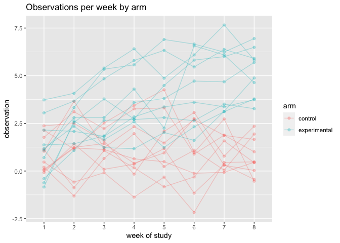

Homework 5
================
Lydia Parr
2019-11-20

Loading in needed package:

``` r
library(tidyverse)
```

## Problem 1

I start by reading in the raw data from the Washington Post. I then:

-   Create a city\_state variable
-   Obtain the number of homicides and the number of unsolved homicides
    based on disposition using `mutate`

``` r
homicide = 
  read_csv("./data/homicide-data.csv", na = c("", "Unknown")) %>%
  mutate(city_state = str_c(city, state), 
         resolution = case_when(
           disposition == "Closed without arrest"  ~ "unsolved", 
           disposition == "Open/No arrest"         ~ "unsolved", 
           disposition == "Closed by arrest"       ~ "solved"))  %>%
  relocate(city_state) %>%
  filter(city_state != "TulsaAL")
```

I then use the prop.test function to estimate the proportion of
homicides that are unsolved in Baltimore, save the output of prop.test
as an R object, apply the broom::tidy to this object to pull the
estimated proportion and confidence intervals from the resulting tidy
dataframe.

``` r
baltimore = homicide  %>%
  filter(city_state == "BaltimoreMD")

baltimore_summary = 
  baltimore %>%
  dplyr::summarize(
    unsolved = sum(resolution == "unsolved"), 
    n = n())

baltimore_test =
  prop.test(
  x = baltimore_summary %>% pull(unsolved), 
  n = baltimore_summary %>% pull(n)
)

baltimore_test %>%
  broom::tidy()
```

    ## # A tibble: 1 x 8
    ##   estimate statistic  p.value parameter conf.low conf.high method    alternative
    ##      <dbl>     <dbl>    <dbl>     <int>    <dbl>     <dbl> <chr>     <chr>      
    ## 1    0.646      239. 6.46e-54         1    0.628     0.663 1-sample… two.sided

I then write a function for the prop.test to iterate across all cities
and obtain proportions and CIs across the data set.

``` r
prop_test_function = function(city_df) {
  city_summary = 
    city_df %>%
    dplyr::summarize(unsolved = sum(resolution == "unsolved"),
              n = n())

city_test = 
  prop.test(
    x = city_summary %>% pull(unsolved), 
    n = city_summary %>% pull(n)
  )
return(city_test)

}

results = homicide  %>%
  nest(data = uid:resolution) %>%
  mutate(
    test_results = map(data, prop_test_function), 
    tidy_results = map(test_results, broom::tidy)
  )  %>%
  select(city_state, tidy_results)  %>%
  unnest(tidy_results) %>%
  select(city_state, estimate, starts_with("conf")) 
```

Next, I make a plot that shows the estimates and CIs for each city,
organized according to the proportion of unsolved homicides.

``` r
results %>% 
  mutate(city_state = fct_reorder(city_state, estimate)) %>% 
  ggplot(aes(x = city_state, y = estimate)) +
  geom_point() +
  geom_errorbar(aes(ymin = conf.low, ymax = conf.high)) +
  theme(axis.text.x = element_text(angle = 90, vjust = 0.5, hjust = 1))
```

<!-- -->

## Problem 2

I create a dataframe containing all file names from the study using the
`list.files` function will help, then read in all files using `map` to
iterate.

Then I tidy the result, including manipulating file names to include
study arm and subject ID.

``` r
data = list.files(path = "./data/problem_2/", 
                  pattern = "*.csv",
                  full.names = T)  %>% 
  map_df(~read_csv(.)) %>% 
  mutate(arm_id = list.files("./data/problem_2/"), 
         subject_id = 1:20) %>% 
  pivot_longer(cols = week_1:week_8, 
               names_to = "week", 
               values_to = "observation") %>% 
  mutate(arm = case_when(str_detect(arm_id, 'con') ~ "control",
                         str_detect(arm_id, 'exp') ~ "experimental"))  %>% 
  mutate_at("week", str_replace, "week_", "")  %>% 
  select(-c(arm_id))
```

Next, I make a spaghetti plot showing observations on each subject over
time, distinguishing the two arms of the study by color.

``` r
data_plot = ggplot(data, aes(x = week, 
             y = observation,
             color = arm)) +
  geom_line(alpha = 0.3, aes(group = subject_id, color = arm)) +
  geom_point(alpha = 0.3, aes(group = subject_id, color = arm)) +
  labs(x = "week of study", 
       y = "observation", 
       title = "Observations per week by arm") +
  theme(legend.position = "right")

data_plot
```

<!-- -->

There were increases in observation values for participants in the
experimental arm, while the observations in the control arm appear
fairly static.

## Problem 3

I load in the iris data set with missing values in each column, then
write a function that:

-   For numeric variables, fills in missing values with the mean of
    non-missing values
-   For character variables, fills in missing values with “virginica”

I then apply this function to the columns of iris\_with\_missing using a
`map` statement.

``` r
set.seed(10)

iris_with_missing = iris %>%
  map_df(~replace(.x, sample(1:150, 20), NA)) %>%
  mutate(Species = as.character(Species)) %>% 
  janitor::clean_names()

filled_in = function(vector) {
  if (is.numeric(vector)) {
    vector = ifelse(is.na(vector), mean(vector, na.rm = TRUE), vector)
    }
  if (is.character(vector)) {
    vector = ifelse(is.na(vector), "virginica", vector)
  }
  return(vector)
}

iris_final = map(iris_with_missing, filled_in) 
```

I can corroborate that this was done correctly by taking the sum of
missing/NA in the final data set: 0
